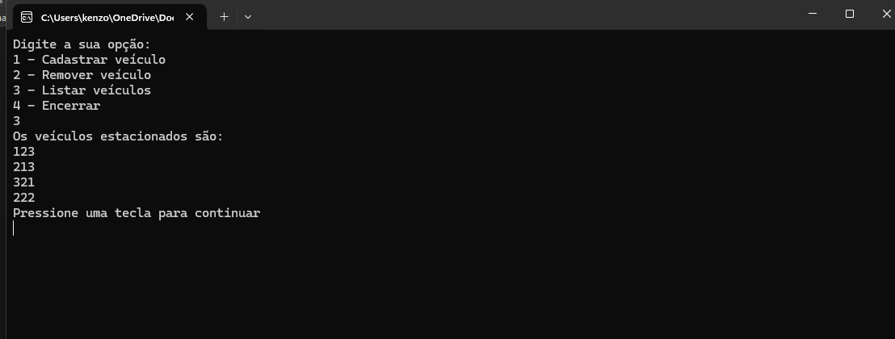

# Sistema de Estacionamento em Console

Este projeto é um sistema de estacionamento desenvolvido em C# como parte de um desafio proposto pelo professor. Todos os requisitos foram fornecidos pelo professor para a implementação.

## Funcionalidades

- **Cadastrar Veículo**: Permite adicionar um novo veículo ao estacionamento.
- **Listar Veículos**: Exibe a lista de veículos atualmente no estacionamento.
- **Remover Veículo**: Permite remover um veículo do estacionamento.
- **Calcular Preço**: Calcula o preço a ser cobrado com base no tempo em que o veículo permaneceu estacionado.

## Estrutura do Projeto

O projeto está organizado nas seguintes pastas e arquivos:

- **Program.cs**: Arquivo principal onde a aplicação começa.
- **Modelos (Models)**: Contém as classes que representam os modelos de dados, como `Veiculo`.
- **Serviços (Services)**: Onde as operações principais, como o cálculo do preço e o gerenciamento dos veículos, são implementadas.
- **Interface (UI)**: Lógica para interação com o usuário no console.


## Exemplo de Uso

```bash
1. Cadastrar Veículo
2. Listar Veículos
3. Remover Veículo
4. Calcular Preço
Selecione uma opção: 
```


